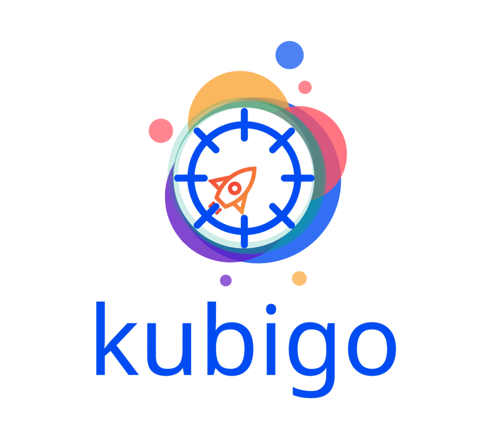

<!-- Place your organization logo below -->

  

<h1 align="center">Welcome to Kubigo 👋</h1>

  Building modern, intuitive tools for Kubernetes cluster management.

 
---

## 🚀 Featured Project: Kubernetes Control Plane Dashboard

A powerful and responsive web-based dashboard for managing multiple Kubernetes clusters with ease.

  

### 🌟 Key Features

- Multi-cluster resource management  
- Pod and deployment monitoring  
- Real-time logs and crash detection  
- Full YAML editing and version rollback  
- Integrated Helm and KEDA support  
- Role-based access control 

🔗 [Explore the project](https://github.com/kubigo/kubigo)

---

## 🤝 Join the Community

We're passionate about open-source and always open to collaboration!  
If you’re interested in contributing, feel free to check out the [issues](https://github.com/kubigo/kubigo/issues) or open a [discussion](https://github.com/kubigo/kubigo/discussions).

---

## 📫 Stay in Touch

- 💬 [Join us on Discord](https://discord.gg/KbXVnFb2jj)  
- 🐦 Twitter: [@KubigoCloud](https://twitter.com/KubigoCloud)  
- 🌐 Website: [kubigo.cloud](https://kubigo.cloud)

---

  ⭐ Star us on GitHub to support our work!

